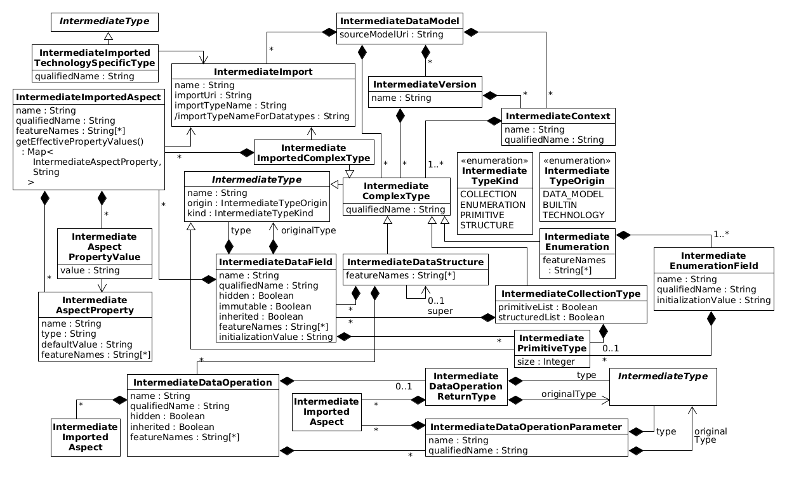

# Intermediate Domain Model Specification

This page specifies the structure and semantics of the
[intermediate metamodel](../index.md) for
[LEMMA domain models](../../../user-guide/domain-data-modeling-language/index.md).
All
[obtained intermediate LEMMA domain models](../obtaining-intermediate-models/index.md)
must conform to this metamodel to ensure consistent behavior of
[LEMMA model processors](../../../user-guide/model-processing/index.md). The
following figure shows the metamodel's structure:

<figure>
    

    <figcaption>
        Structure of the metamodel for intermediate domain models
    </figcaption>
</figure>



