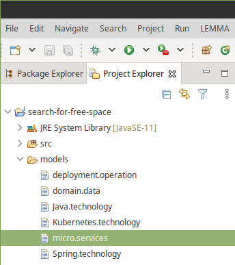
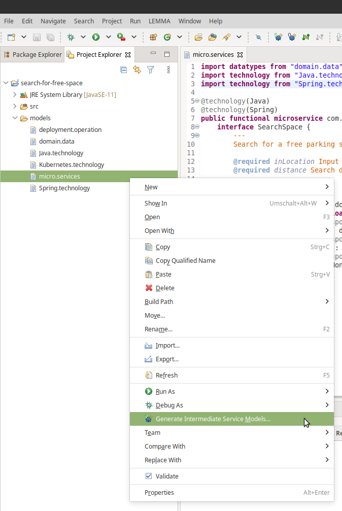
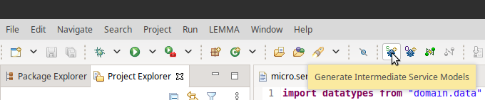
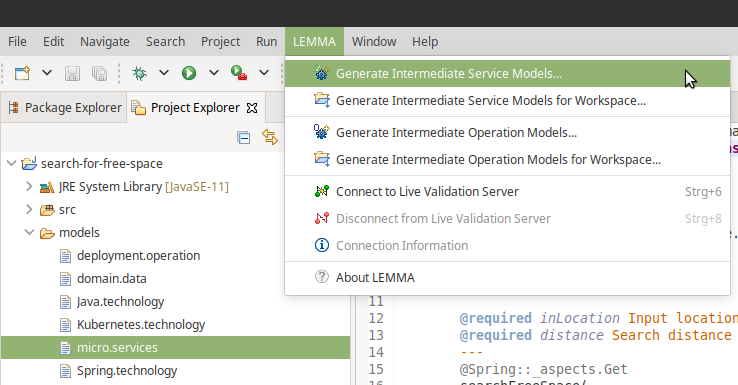
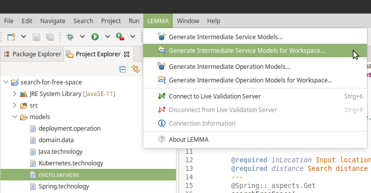
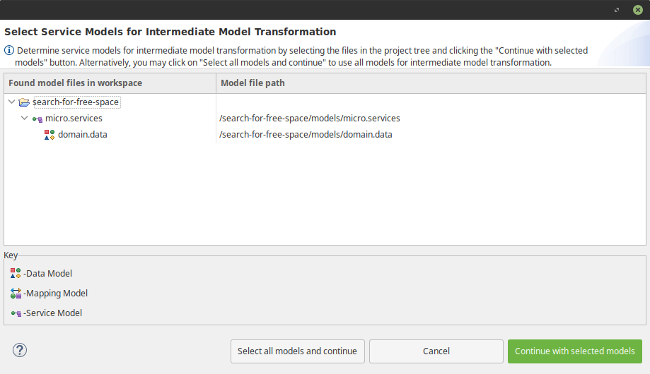
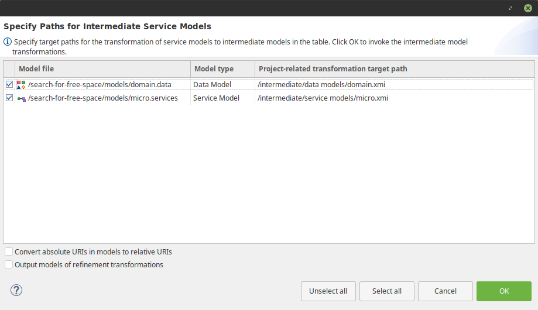
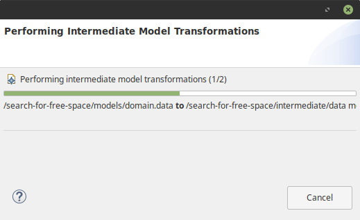
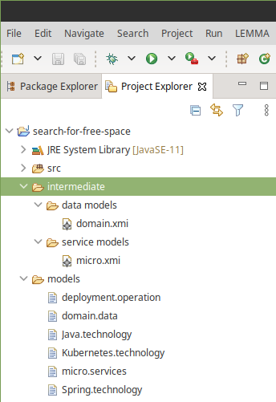

# Obtaining Intermediate Models

In the following, we exemplify the process to practically obtain the
intermediate representation of a LEMMA service model, i.e., a LEMMA
*intermediate service model*. This model conforms to the
[intermediate specification for LEMMA service models](../intermediate-service-model-specification/index.md)
or, more precisely, the intermediate metamodel of LEMMA's
[Service Modeling Language](../../../user-guide/service-modeling-language/index.md).

## Handling of Imported Models

By default, the derivation of the intermediate representation of a LEMMA model
also considers the handling of imported models. However, the concrete handling
of imported models depends on their kind:

- **Domain Models**: By default, the derivation of intermediate service models
    also comprises the derivation of the intermediate representations of all
    imported LEMMA
    [domain models](../../../user-guide/domain-data-modeling-language/index.md).
- **Technology Models**: The information from
    [technology models](../../../user-guide/technology-modeling-language/index.md)
    is always incorporated into intermediate domain, service, or operation models.
- **Service Models**: By default, the derivation of intermediate service models
    also comprises the derivation of the intermediate representations of all
    imported LEMMA service models.
- **Mapping Models**: Similarly to technology models, the information from
    [mapping models](../../../user-guide/service-technology-mapping-modeling-language/index.md)
    is always incorporated into intermediate domain, service, or operation
    models. In addition, LEMMA supports the derivation of intermediate models
    from service models imported into mapping models. Since the derivation of
    these intermediate models boils down to the iterative transformation of
    imported service models into their intermediate representations, it also
    involves the derivation of the intermediate representations of domain
    models, which are imported by mapped service models, by default.
- **Operation Models**: By default, the derivation of intermediate
    [operation models](../../../user-guide/operation-modeling-language/index.md)
    also comprises the derivation of the intermediate representations of all
    imported LEMMA service models and their imported domain models.

## Obtaining Intermediate Service Models Using the Eclipse IDE

LEMMA provides users with an Eclipse plugin for GUI-based and guided
intermediate model derivation. While in the following we illustrate the usage of
this plugin for LEMMA service models, the process is the same for obtaining
intermediate models from LEMMA mapping and operation models.

!!! note
    We employ the same service model from the
    [tour of LEMMA features](../../../getting-started/tour/#step-3-create-a-service-model).
    Recall that the model resides in a file called
    `{{ lemma_tour_service_model_file }}` visible in the Project Explorer of the
    corresponding Eclipse workspace:
    <figure>
        
    </figure>

    The code of the `{{ lemma_tour_service_model_file }}` is as follows:
    ```lemmaservices
    --8<-- "getting-started/tour/example_models/technology-extensions-ChargingStationManagementCommandSide.services"
    ```

### Step 1: Start an Intermediate Model Derivation Process

LEMMA's Eclipse plugin for intermediate model derivation supports two modes to
transform LEMMA models into intermediate representations:

#### Single-Model Mode

In this mode, only the currently selected model will be considered for
intermediate model derivation. To activate this mode, right-click on the model
in the Eclipse Project Explorer and select the
"Generate Intermediate `$MODEL_KIND` Models..." entry from the context menu,
whereby the `$MODEL_KIND` string indicates the kind of the selected model, e.g.,
"Service" or "Operation". For the example service model
`{{ lemma_tour_service_model_file }}`, the context menu with the transformation
entry looks as follows:
<figure>
    
</figure>

Alternatively, to activate single-model mode, you might as well hit the
following button that the Eclipse plugin contributes to the Eclipse toolbar:
<figure>
    
</figure>

In addition, single-model mode is reachable from LEMMA's Eclipse menu:
<figure>
    
</figure>

#### Multi-Model Mode

This mode enables bulk transformation of LEMMA models in the current Eclipse
workspace into their intermediate representations. The mode can be activated
from LEMMA's Eclipse menu:
<figure>
    
</figure>

### Step 2: Select Models for Intermediate Transformation

Independent of the selected intermediate transformation mode (cf. Step
[1](#step-1-start-an-intermediate-model-derivation-process)), LEMMA's Eclipse
plugin for intermediate model transformation shows a dialog window that allows
fine-grained selection of the models to derive intermediate representations
from.

When activating single-model transformation on the example service model
`{{ lemma_tour_service_model_file }}`, the model selection dialog window looks
as follows:
<figure>
    
</figure>

The dialog window groups the LEMMA models that can be transformed into
intermediate representations by their projects in the current Eclipse workspace.
Furthermore, a model clusters all transformable models, which it imports. Thus,
the above model selection dialog window for the
`{{ lemma_tour_service_model_file }}` service model comprises a node for the
model's Eclipse project, i.e., `{{ lemma_tour_models_project_name }}`, a node
for the service model, as well as a node for the
[`{{ lemma_tour_domain_model_file }}` domain model](../../../getting-started/tour/#step-2-create-a-domain-model),
which is imported by the service model and represents a transformable model.

From the dialog window, we can determine the set of models to derive
intermediate representations from by selecting them with a mouse click on their
node and hitting the "Continue with selected models" button. Alternatively, we
can also hit the "Select all models and continue" button, which will select all
displayed models for subsequent intermediate transformation.

### Step 3: Specify Transformation Target Paths

After confirmation of the model selection dialog (cf. Step
[2](#step-2-select-models-for-intermediate-transformation)), LEMMA's Eclipse
plugin for intermediate model transformation expects the specification of target
paths for the intermediate models to derive. To this end, the plugin displays
the following dialog window:
<figure>
    
</figure>

The table in the dialog window contains all models that were selected in the
previous dialog window and informs about certain transformation-related
characteristics per model:

1. **Selection column**: This column contains a checkbox with which a model may
    be deselected from transformation. By contrast to the previous model
    selection dialog, the target path specification dialog enables to also
    deselect imported models like `{{ lemma_tour_domain_model_file }}`. By
    default, all listed model files are selected for their intermediate
    transformation.
2. **Model file**: Model file path relative to its Eclipse project.
3. **Model type**: Model file type.
4. **Project-related transformation target path**: Target path for the derived
    intermediate model. The column is editable and allows specification of
    transformation target paths *relative to the Eclipse project of the model*
    *file*. The default transformation target path consists of the
    "intermediate" folder, the "`$MODEL_TYPE` models" folder (where
    `$MODEL_TYPE` corresponds to the type of the model in the third table
    column), and the name of the model file with its extension changed to "xmi"
    (to indicate that the resulting intermediate model follows the XMI format).

In addition to the table, the dialog window comprises two checkboxes, which
concern the intermediate transformation process of *all* models:

- **Convert absolute URIs in models to relative URIs**: Intermediate
    transformation involves the conversion of import URIs into absolute file
    paths. For example, the transformation process will adapt the
    path to the `{{ lemma_tour_domain_model_file }}` model, which is
    [imported by the `{{ lemma_tour_service_model_file }}` model](../../../getting-started/tour/#step-3-create-a-service-model)
    via the LEMMA statement
    `#!lemmaservices import datatypes from "{{ lemma_tour_domain_model_file }}" as domain`, to an
    absolute file URI in the user's file system, e.g.,
    "file:///home/user/models/{{ lemma_tour_domain_model_file }}". While this
    approach supports immediate model processing independent of model files'
    location on the user's file system, it is not portable. More precisely, when
    moving model files to another computer, the absolute import paths become
    invalid as they are system-specific. The checkbox prevents this issue as it
    converts import URIs to file URIs relative to the most common path of the
    transformed models as selected in the target path specification dialog. For
    instance, when not adapting the default transformation target path, the
    import URI of the `{{ lemma_tour_domain_model_file }}` model within the
    intermediate representation of the `{{ lemma_tour_service_model_file }}`
    model will resolve to "../data models/domain.xmi".
- **Output models of refinement transformations**: The intermediate
    transformation process consists of several model transformation modules
    written in [ATL]({{ atl_url }}). Depending on the transformation scenario,
    *ATL refinement transformations* may occur during the transformation
    process. The transformations take a LEMMA model as input, adapt it as
    determined by the transformation scenario, and output this *refined* model.
    Such refinement transformations enrich, e.g., domain models with technology
    information from mapping models. For the user the results of these
    refinement transformations are not visible by default, because the
    transformation process passes them to the next transformation step in the
    form of in-memory object graphs. However, the "Output models of refinement
    transformations" option allows serialization of possible refined models for
    debugging purposes.

When hitting the "OK" button in the target path specification dialog, the
intermediate model transformation process starts.

### Step 4: Intermediate Model Serialization

A dialog window informs about the progress of the intermediate transformation
process:

<figure>
    
</figure>

If the derivation of the intermediate representations of all selected LEMMA
models was successful, the progress dialog window disappears and the XMI files
of the intermediate models can be found in the user's file system at the
locations determined in the target path specification dialog (cf. Step
[3](#step-3-specify-transformation-target-paths)). In case the default paths
were not changed, the Eclipse projects of the input LEMMA models comprise an
"intermediate" folder that stores the XMI files:

<figure>
    
</figure>
