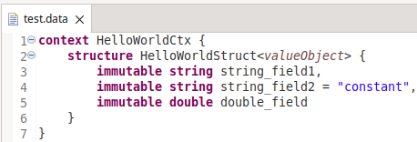

# Installation

The implementation of LEMMA's modeling languages is based on
[Eclipse](https://www.eclipse.org) and the majority of LEMMA's components comes
as a set of plugins for the [Eclipse IDE](https://www.eclipse.org/ide). To
facilitate the installation of these plugins, we provide an Eclipse Updatesite
for LEMMA, which you can install via the steps described below.

## 1. Download a Suitable Package of the Eclipse IDE
LEMMA relies on various Eclipse modeling technologies, among them
[ATL](https://www.eclipse.org/atl) and [Xtext](https://www.eclipse.org/Xtext).
To install LEMMA, it is therefore required to obtain a package of the Eclipse
IDE that bundles all or most of these technologies, and to install the missing
technologies afterwards.

The simplest approach to install LEMMA is to first

<div markdown="1" align="center">
[Download the Eclipse IDE for Java and DSL Developers](https://www.eclipse.org/downloads/packages/release/{{ current_eclipse_release }}/r/eclipse-ide-java-and-dsl-developers){ .md-button }
</div>

because the `Eclipse IDE for Java and DSL Developers` package already includes
the required Xtext technology.

!!! info "Required Eclipse Release"
    The above download link for the Eclipse package points to the Eclipse
    release **{{ current_eclipse_release }}**, which at the time of writing is
    the latest release of Eclipse. However, you can use LEMMA with any Eclipse
    release greater or equal **{{ minimum_eclipse_release }}**. Just make sure
    to always download the `Eclipse IDE for Java **and DSL Developers**`.

## 2. Install Additional Technologies
LEMMA requires the ATL and Xtext technologies. You can install both technologies
from within your Eclipse IDE by means of the
[Eclipse Marketplace](https://marketplace.eclipse.org/marketplace-client-intro).

<div markdown="1" align="center">
[Install ATL from the Eclipse Marketplace](https://marketplace.eclipse.org/content/atlemftvm){ .md-button }
</div>

!!! info "Installation of Xtext"
    In case you have **not** downloaded the
    `Eclipse IDE for Java and DSL Developers` as described above in Step 1, you
    can retrofit your Eclipse installation with Xtext also from the Eclipse
    Marketplace.
    <div markdown="1" align="center">
        [Install Xtext from the Eclipse Marketplace](https://marketplace.eclipse.org/content/eclipse-xtext){ .md-button }
    </div>

## 3. Install LEMMA
LEMMA can be installed in a prepared Eclipse IDE (cf. Step 2) by means of
Eclipse's [Updatesite mechanism](https://help.eclipse.org/{{ current_eclipse_release }}/index.jsp?topic=/org.eclipse.platform.doc.user/tasks/tasks-127.htm).
LEMMA's Updatesite can be found at

<div align="center">
<pre id="__code_0"><button class="md-clipboard md-icon" title="Copy to clipboard" data-clipboard-target="#__code_0 > code"></button><code><a href="{{ lemma_updatesite_url }}">{{ lemma_updatesite_url }}</a></code></pre>
</div>

Restart your Eclipse IDE after the installation of LEMMA from the Updatesite.

## 4. Verify Installation
A first indicator for the successful installation of LEMMA is provided by the
new entry "LEMMA" in Eclipse's main menu. Click on the menu entry and select the
sub-menu entry "About LEMMA". The following window should appear to indicate the
currently installed version of LEMMA.

<figure>
  
  <figcaption>LEMMA's About dialog.</figcaption>
</figure>

In addition, you can verify if the installation of LEMMA was successful by
creating a model in one of [LEMMA's modeling languages](../user-guide):

1. Create a new Java project in Eclipse.
2. Within the project, create a new file called `test.data`. Note that it is
mandatory to use the extension `.data` as otherwise Eclipse will not be able to
associate the file with
[LEMMA's Domain Data Modeling Language](../user-guide).  
In case the "Configure Xtext" dialog appears, just hit "Yes":  
<figure>
  
  <figcaption>Configure Xtext dialog.</figcaption>
</figure>  
3. Add the following model code to the `test.data` file:
```lemmadomaindata
context HelloWorldCtx {
	structure HelloWorldStruct<valueObject> {
        string string_field1,
        immutable string string_field2 = "constant",
        double double_field,
        hide unspecified typeNotSpecifiedYet
    }
}
```

Eclipse should highlight the model code as follows:
<figure>
  
  <figcaption>Example model code highlighted in Eclipse.</figcaption>
</figure>

Congratulations, you have successfully installed LEMMA. Now, you may want to
take the [Tour](tour) and explore some of LEMMA's core features.

## Troubleshooting
Having trouble with the installation of LEMMA? Please do not hesitate to contact
us via [e-mail](mailto:{{ info_email }}) or
[open issue at LEMMA's GitHub page]({{ lemma_github_url }}/issues).
