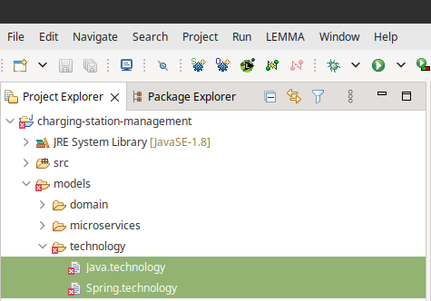

# Tour
In the following, we demonstrate some of the basic features of LEMMA regarding
the construction and processing of microservice architecture models.

## Prerequisites
To reproduce the presented *modeling steps*, you should first
[install LEMMA](../index.md) on your computer.

To reproduce the presented *model processing steps*, the easiest way is to
employ the [Docker]({{ docker_url }}) images of LEMMA's Java and deployment code
generators. An installation of LEMMA already comes with an Eclipse plugin to
simplify the usage of these images. However, the plugin uses Docker to
instrument and execute the images so that you are required to
[install Docker on your computer]({{ docker_installation_url }}) as an
additional technology. After having installed Docker, you can retrieve the
images of LEMMA's Java and deployment code generators using the following
commands in a commandline terminal that can access your Docker installation:

```bash
docker pull lemmahub/java_generator
docker tag lemmahub/java_generator:latest lemma/java_generator:latest

docker pull lemmahub/deployment_base_generator
docker tag lemmahub/deployment_base_generator:latest lemma/deployment_base_generator:latest
```

## The Charging Station Management Example
For the tour of LEMMA, we leverage a single microservice from an MSA[^1]-based
application as example. Basically, the application supports the management of
parking spaces that are equipped with charging stations for electric vehicles.
In the following, we will refer to this application as the "Park and Charge
Software Platform", or short PCSP.

The PCSP consists of several microservices, e.g., for user management, charging
station search, and charging station management. For the tour of LEMMA, we will
model the domain data, API, and deployment of the latter microservice, i.e., the
`{{ lemma_tour_service_name }}` microservice. This microservice shall provide its
clients with means to create parking spaces with charging stations at a
specific location.

!!! info "Learn More About the PCSP"
    You can learn more about the PCSP, and the rationale and decisions
    concerning its design in Sections 8.3 to 8.5 of the dissertation that
    conceived LEMMA[^2].

## What You Will Learn During the Tour
In the following you will learn how to construct the following types of LEMMA
models for the `{{ lemma_tour_service_name }}` microservice:

- Domain model: Defines the domain data of the microservice.
- Service model: Defines the API of the microservice.
- Operation model: Defines the deployment of the microservice.

In addition, you will receive an impression on how model processing works with
LEMMA. More specifically, you will learn how to derive executable Java code from
the constructed models.

The next sections will teach you how to construct the aforementioned LEMMA
models for the `{{ lemma_tour_service_name }}` microservice by means of a
[LEMMA-enabled Eclipse installation](../index.md). If you do not want to
construct the models on your own, you can also find them in LEMMA's GitHub
repository in the
[/examples/charging-station-management/models]({{ lemma_tour_model_repository_url }})
folder.

## Step 1: Create an Eclipse Project
Run your [LEMMA-enabled Eclipse installation](../index.md) and create a new Java
project called `{{ lemma_tour_models_project_name }}`. We will use this project
to gather all models for the `{{ lemma_tour_service_name }}` microservice. In
addition, create a folder called `models` within the project.

The Project Explorer of your Eclipse workspace should now look similar to this:
<figure>
  
</figure>

## Step 2: Create a Domain Model
LEMMA provides several modeling languages to express different viewpoints on a
microservice architecture. A crucial viewpoint in almost every software project
including MSA-based applications is the *domain viewpoint*. Therefore, LEMMA
comprises the
[Domain Data Modeling Language](../../user-guide/domain-data-modeling-language/index.md)
to enable domain experts and microservice developers to collaboratively
construct *domain models*.

You will now create a LEMMA domain model for the `{{ lemma_tour_service_name }}`
microservice by means of the Eclipse IDE. To this end, you first create a folder
called `domain` in the `models` folder of the previously created
`{{ lemma_tour_models_project_name }}` Eclipse project. Next, you create a file
called `{{ lemma_tour_domain_model_file }}` within the `domain` folder. In case
a dialog pops up, asking you to convert the
`{{ lemma_tour_models_project_name }}` project to an Xtext project, just
confirm it with `Yes`. The `.data` extension of the domain model file is crucial
as it signals Eclipse that the file constitutes a LEMMA domain model for which a
dedicated Eclipse editor with syntax highlighting and interactive model
validation exists.

After having created the `domain` folder and the
`{{ lemma_tour_domain_model_file }}` in it, the Project Explorer of your Eclipse
workspace should now look similar to this:
<figure>
  
</figure>

Eclipse shows an error marker for the new model file because LEMMA's
[Domain Data Modeling Language](../../user-guide/domain-data-modeling-language/index.md)
does not allow empty domain models. To fix this issue, add the following model
code to the `{{ lemma_tour_domain_model_file }}` file by double-clicking the
file in Eclipse's Project Explorer and entering the code in the text editor that
just opened:

```lemmadomaindata
--8<-- "getting-started/tour/example_models/{{ lemma_tour_domain_model_file }}"
```

### Bounded Contexts
The
[Domain Data Modeling Language](../../user-guide/domain-data-modeling-language/index.md)
enables to organize the concepts of a microservice's domain excerpt within
*contexts*. LEMMA's notion of context is inspired by the
[Bounded Context pattern]({{ bounded_context_url }}) from
[Domain-driven Design (DDD)]({{ ddd_def_url }}) and its importance for the
[tailoring of microservices' domain responsibilities]( {{ msa_bc_url }} ).

For the definition of contexts, the
[Domain Data Modeling Language](../../user-guide/domain-data-modeling-language/index.md)
provides the `context` keyword, which must be followed by the name of the
context, and a pair of curly brackets to comprise the context's *domain concepts*
(see below). Based on the `context` keyword, the domain model of the
`{{ lemma_tour_service_name }}` microservice defines the
`ChargingStationManagement` context as a cluster for its domain concepts. LEMMA
supports three different kinds of domain concepts.

### Structured Domain Concepts and Domain-Driven Design
A structured domain concept (or *data structure*) is introduced by the
`structure` keyword, followed by the name of the structure, and an arbitrary
number of *features*. In LEMMA domain models, a feature assigns additional
semantics, e.g., from patterns for
[tactical DDD]({{ ddd_tactical_patterns_url }}), to a domain concept. Consider
the `Location` structure from the domain model of the
`{{ lemma_tour_service_name }}` microservice. It receives the `valueObject`
feature to identify it as a [DDD Value Object]({{ ddd_value_object_def_url }}).

A data structure can define an arbitrary number of typed and named *data fields*
within curly brackets. In total, the `Location` structure consists of the two
data fields `latitude` and `longitude`, both being typed as `double`s. LEMMA
supports all of Java's [primitive types]({{ java_primitive_types_url }}), and
also has built-in types for `date`s and `String`s.

Next to their types and names, both data fields of the `Location` structure also
exhibit the `immutable` modifier. It signals that fields can only receive values
during the instantiation of of their defining structure. Afterwards, the values
remain stable for the instance's lifetime and are not modifiable by callers.
Since the primary use of DDD Value Objects is information sharing, e.g., in the
form of [Data Transfer Objects]{{ dto_definition_url }}, it is a best practice
to flag their fields as `immutable`.

The `ParkingArea` concept is another example of a data structure in the domain
model of the `{{ lemma_tour_service_name }}` microservice. By contrast to the
`Location` structure, `ParkingArea` receives the features `aggregate` and
`entity`. It is thus a [DDD Aggregate]({{ ddd_aggregate_def_url }}) and
[DDD Entity]({{ ddd_entity_def_url }}). In DDD terms, this combination of
patterns identifies `ParkingArea` as a *root entity* whose instances must
support persistence, e.g., by storing them in a database. This latter
characteristic is one of the fundamental differences between DDD Value Objects
and Entities.

The `ParkingArea` concept clusters seven data fields:

- `id`: This field is the `identifier` of the root entity and its value allows
for distinguishing between `ParkingArea` instances.

- `name` and `description`: These `String`-typed data fields store the name and
description of a `ParkingArea`.

- `location`: By contrast to the previous fields, `location` is not of a
built-in primitive type but a custom complex type. More specifically, the
field's type is the `Location` structure from the same context. Hence, a
runtime value of the field will be a structure with the two nested fields
`latitude` and `longitude`. Additionally, the field receives the `part` feature
to express the intention that its values are always stored to and fetched from
databases as part of the defining `ParkingArea` instance. This notion of
aggregate-part-relationships follows DDD, in which aggregates determine a
transactional boundary in the sense that the complex parts of an aggregate (i)
are only accessible for callers using the aggregate; (ii) can only sensibly
exist when their aggregate exists; and (iii) that they are in a valid state as
prescribed by domain-specific rules when their aggregate is stored to or fetched
from a database.

- `chargerSpeed`: This field informs about the speed by which the charging
capabilities of a `ParkingArea` may provide electric vehicles with energy.
Again, the field's type is a custom complex type, i.e., the `ChargerSpeed`
enumeration. You will learn more about enumerations below.

- `availability`: This field stores information about the availability of a
`ParkingArea` in the form of the two `date` fields `start` and `end`. Since a
`ParkingArea` may be opened and closed at different times on different dates or
time spans, the field's type is the custom collection `TimePeriods`. You will
learn more about collections below.

- `activated`: This field enables to flexible activate and deactivate the
charging capabilities of a `ParkingArea`, e.g., for maintenance purposes. Since
the field must only maintain a true/false condition, it is of the built-in
primitive type `boolean`.

### Enumeration Domain Concepts
LEMMA's
[Domain Data Modeling Language](../../user-guide/domain-data-modeling-language/index.md)
supports the definition of enumerations in domain models. An enumeration domain
concept is introduced by the `enum` keyword, followed by the enumeration name,
and its literals in curly brackets.

For example, the `ChargerSpeed` enumeration in the domain model for the
`{{ lemma_tour_service_name }}` microservice defines the literals `FAST` and
`NORMAL` for coarse-grained identification of the capacity of charging
capabilities on a certain `ParkingArea`.

### Collection Domain Concepts
Next to data structures and enumerations, LEMMA's
[Domain Data Modeling Language](../../user-guide/domain-data-modeling-language/index.md)
allows for defining collection domain concepts by means of the `collection`
keyword, followed by the collection name, and the collection body in curly
brackets.

The domain model for the `{{ lemma_tour_service_name }}` microservice defines
the `TimePeriods` collection. It clusters sequences of instances of the
`TimePeriod` structure and is thus a *structured collection type*. In LEMMA, the
structure of entries of a structured collection type is determined by the
data fields in its body, e.g., `TimePeriod p`. *Primitive collection types*, on
the other hand, exhibit bodies with exactly one built-in primitive type, e.g.,
`int`, and without an additional field name. Such collection types store
sequences of primitive values. For instance, a hypothetical collection

!!! example ""
    `collection Numbers { int }`

stores an arbitrary amount of integer values.

### Additional Domain Concepts for Microservice Interaction
Before you are going to create a service model for the
`{{ lemma_tour_service_name }}` microservice in the upcoming
[Step 3](#step-3-create-a-service-model), you will first extend the above domain
model with domain concepts dedicated to microservice interaction.

After the `TimePeriod` structure, add the three structures
`CreateParkingAreaCommand`, `ParkingAreaInformation`, and
`CreateParkingAreaCommandResponse` to the domain model file
`{{ lemma_tour_domain_model_file }}`:

```lemmadomaindata
--8<-- "getting-started/tour/example_models/interaction-extensions-{{ lemma_tour_domain_model_file }}"
```

All three domain concepts are DDD Value Objects because the
`{{ lemma_tour_service_name }}` microservice will use them to communicate
information about parking areas to consumers. Note that the
`ParkingAreaInformation` value object is a reduced version of the `ParkingArea`
aggregate in the sense that it only comprises those data fields relevant to
consumers. To foresee the required conversion of `ParkingArea` instances into `ParkingAreaInformation` instances, you could further extend the domain model
with corresponding a LEMMA *function signature* in the `ParkingArea` aggregate:

```lemmadomaindata
context ChargingStationManagement {
    ...

    structure ParkingArea<aggregate, entity> {
        ...
        // Function signature to convert the current ParkingArea instance
        // into a ParkingAreaInformation instance
        function ParkingAreaInformation toParkingAreaInformation
    }

    ...
}
```

A LEMMA function signature starts with the `function` keyword, followed by the
return type, and the name of the function. Potential input parameters follow
in round brackets, and consist of a type and name. In case of an empty parameter
list, the round brackets can be omitted as is the case for the
`toParkingAreaInformation` function.

LEMMA's
[Domain Data Modeling Language](../../user-guide/domain-data-modeling-language/index.md)
also supports *procedure signatures* for domain concept operations that do not
return a value. A procedure signature starts with the `procedure` keyword,
followed by the name of the procedure, and an optional parameter list. For
instance, a hypothetical procedure signature

!!! example ""
    `procedure updateChargerSpeed(ChargerSpeed newSpeed)`

constitutes a procedure signature `updateChargerSpeed` with a single parameter
`newSpeed` typed by the enumeration domain concept `ChargerSpeed`.

The following listing shows the complete domain model file including the three
domain concepts for microservice interaction and the `toParkingAreaInformation`
function signature:

```lemmadomaindata
--8<-- "getting-started/tour/example_models/complete-{{ lemma_tour_domain_model_file }}"
```

## Step 3: Create a Service Model
In this step, we use LEMMA's
[Service Modeling Language](../../user-guide/service-modeling-language/index.md)
to construct a *service model* for the `{{ lemma_tour_service_name }}`
microservice. The modeling language covers the concerns of microservice
developers, thereby providing a means to capture the *service viewpoint* on a
microservice architecture.

In the `models` folder of the `{{ lemma_tour_models_project_name }}` Eclipse
project, create a new folder called `microservices` and within that folder
create another folder called `command-side`. Within the `command-side` folder,
create a file called `{{ lemma_tour_service_model_file }}`. The `.services`
extension signals Eclipse that the file constitutes a LEMMA service model. The
Project Explorer of your Eclipse workspace should now look similar to this:
<figure>
  
</figure>

!!! info "Rationale for the Folder Structure"
    You may wonder why the service model file is nested within its own folder
    `command-side` and why it does not reside immediately within the folder
    `microservices`. The rationale for this folder structure is the fact that
    the PCSP applies the
    [Command Query Responsibility Segregation (CQRS)]({{ cqrs_pattern_def_url}})
    pattern to organize its microservices. That is, each logical microservice
    consists of at most one physical *command side microservice* and one or more
    physical *query side microservices*. While the command side of a logical
    PCSP microservice is responsible for write actions like updating database
    entries, the query sides provide operations for read actions, e.g., querying
    database entries with certain characteristics.

    The query sides maintain their own databases and receive information about
    entry updates from command sides in an asynchronous fashion. As a result,
    CQRS permits independent scalability of write and read actions, of which the
    latter are usually much more frequent than the former, as well as the
    adoption of database technologies specialized for certain kinds of read
    actions, e.g., time series processing.

    For the tour of LEMMA, you will model the physical command side microservice
    of the logical `{{ lemma_tour_service_name }}` microservice. Consequently,
    we cluster related models in their own folder, i.e., `command-side`, and
    even attach the suffix `C[Step 2](#step-2-create-a-domain-model)s, you can
    find them in LEMMA's GitHub repository in the
    [/examples/charging-station-management/models/microservices/query-side]({{ lemma_tour_model_repository_query_side_url }})
    folder.

As for the initial domain model constructed in
[Step 2](#step-2-create-a-domain-model), LEMMA does not allow empty service
models and thus displays an error marker for the
`{{ lemma_tour_service_model_file }}` file. To fix this issue, add the following
code in LEMMA's
[Service Modeling Language](../../user-guide/service-modeling-language/index.md)
to the file:

```lemmaservices
--8<-- "getting-started/tour/example_models/technology-agnostic-{{ lemma_tour_service_model_file }}"
```

### Domain Concept Imports
LEMMA's modeling languages provides the `import` keyword to enable integratation
of models for the same or different viewpoints on a microservice architecture.
`import` statements always have the following syntactic form:

!!! example ""
    `import [ELEMENT_TYPE] from "[MODEL_PATH]" as [ALIAS]`

In the above service model for the command side of the
`{{ lemma_tour_service_name }}` microservice, the imported `[ELEMENT_TYPE]` is
`datatypes` which accounts for the import of domain concepts in order to type
service operation parameters (see below). The `[MODEL_PATH]` points to the
`{{ lemma_tour_domain_model_file }}` that you constructed in
[Step 2](#step-2-create-a-domain-model). Instead of the relative path from
the folder that holds the service model file, i.e.,
`models/microservices/command-side`, to the folder that holds the domain model
file, i.e., `models/domain`, you could also specify the absolute path to the
imported domain model, e.g.,
`/home/user/lemma-tour/models/domain/{{ lemma_tour_domain_model_file }}`.
Finally, the `[ALIAS]` of an `import` statement determines a shorthand name for
referencing imported model elements. In the above service model, all concepts
imported from the domain model `{{ lemma_tour_domain_model_file }}` are to be
referenced under the alias `Domain`.

### Microservice Definition
In LEMMA's
[Service Modeling Language](../../user-guide/service-modeling-language/index.md),
a microservice definition is introduced by an optional *visibility modifier*,
followed by a mandatory *service type identifier*, the keyword `microservice`,
and the fully-qualified name of the microservice.

In the above command side service model, the visibility modifier for the
`{{ lemma_tour_service_name }}CommandSide` microservice is `public` to express
the intent that the microservice shall be available to consumers that are not
part of the same microservice architecture. Microservices without an explicit
visibility modifier receive have `architecture` visibility, i.e., they are
visible only to consumers that belong to the same architecture and are not to be
exposed to external consumers.

The service type identifier is `functional` which marks the microservice to
fulfill a functional, usually business-oriented, capability within the PCSP.
Other service type identifiers are `infrastructure` (the microservice provides
an infrastructure capability, e.g., monitoring) and `utility` (the microservice
provides a reusable utility capability that is not motivated by only a single
business case, e.g., currency conversion).

The `microservice` keyword is followed by the name of the microservice. A
microservice name must have at least one qualifying level to determine the
microservice's *namespace*. Qualifying levels are separated by dots (`.`) and
all qualifying levels except the last one constitute the microservice's
namespace[^3]. Consequently, the fully-qualified name of the
`{{ lemma_tour_service_name }}CommandSide` microservice is
`de.puls.{{ lemma_tour_service_name }}CommandSide`. It consists of the namespace
`de.puls` and the microservice's simple name
`{{ lemma_tour_service_name }}CommandSide`.

### Interface Definition
The definition of a microservice ends with a pair of curly brackets that
cluster the service's interfaces. In LEMMA, each microservice must comprise at
least one interface, and each interface specifies a single portion of the
service's API[^4] as a collection of one or more service operations (see below).

LEMMA's
[Service Modeling Language](../../user-guide/service-modeling-language/index.md),
provides the `interface` keyword to introduce an interface. The keyword is
followed by the name of the interface. That is, the above service model for the
`{{ lemma_tour_service_name }}CommandSide` microservice defines a single
interface called `CommandSide`.

Like microservices, interfaces can receive visibility modifiers. Without an
explicit visibility modifier, interfaces inherit the visibility of their
defining microservices. As a result, the visibility of the `CommandSide`
interface is `public` as this is the visibility of the
`{{ lemma_tour_service_name }}CommandSide` microservice.

### Operation Definition
The definition of an interface ends with a pair of curly brackets that cluster
the interface's operation. In LEMMA, each interface must comprise at least one
operation.

An operation definition does not require an introductory keyword. Instead, you
state the name of the operation, followed by a pair of round brackets for
possible parameters, and a semicolon to end the operation definition. Thus, in
the above service model for the `{{ lemma_tour_service_name }}CommandSide`
microservice, the `CommandSide` interface consists of a single operation
`createParkingArea` which has two parameters (see below).

LEMMA's
[Service Modeling Language](../../user-guide/service-modeling-language/index.md)
also integrates a special syntax for *API operation comments*. It allows the
documentation of an operation's purpose and can later be translated, e.g., into
[OpenAPI specifications]({{ openapi_spec_url }}). An API operation comment has
to occur before the operation's definition and within a pair of three
consecutive dashes (`---`). Hence, the `createParkingArea` operation exhibits
the API operation comment `API endpoint for creating a parking area`.

Operation parameters may also receive a documentation as part of an API
operation comment. For this purpose, LEMMA provides the *built-in annotations*
`@param`, `@requires`, and `@returns`. `@param` and `@requires` document
incoming operation parameters that are either optional (`@param`) or mandatory
(`@requires`). `@returns`, on the other hand, documents outgoing operation
parameters. After a built-in documentation annotation, the name of the parameter
and the documentation comment follow. In the above service model for the
`{{ lemma_tour_service_name }}CommandSide` microservice, you documented the
purpose of the `createParkingArea` operation's incoming parameter `command` and
the outgoing parameter `response`, respectively.

### Parameter Definition
A modeled service operation may receive and return an arbitrary number of
parameters. A parameter definition starts with a keyword that identifies the
parameter's *communication type*. The `sync` keyword introduces parameters that
an operation expects to receive or promises to return synchronously. The `async`
keyword, on the other hand, introduces parameters that an operation expects to
receive or promises to return asynchronously.

Next to a communication type, a parameter definition in LEMMA's
[Service Modeling Language](../../user-guide/service-modeling-language/index.md)
can explicitly state the *direction* of a parameter which can be incoming (`in`
modifier), outgoing (`out` modifier), or bidirectional (`inout` modifier). In
case a parameter definition omits a direction modifier, the parameter is assumed
to be incoming.

A parameter definition is concluded by the parameter's name, a colon, and the
parameter's type. The type of a parameter may either be a built-in primitive
type like `int` or `String`, or a domain concept imported from a LEMMA domain
model (see above). To reference an imported domain concept for typing purposes,
you first have to state the alias of the import, e.g., `Domain`, followed by two
consecutive colons (`::`), and the fully-qualified name of the concept within
the imported domain model. The fully-qualified name of a domain concept consists
of the name of the concept's context and the name of the concept itself
separated by a dot.

The following table identifies the communication type, direction, and type of
each parameter of the `createParkingArea` operation from the above service model
for the `{{ lemma_tour_service_name }}CommandSide` microservice

Parameter  | Communication Type   | Direction        | Type |
| :--------| :------------------: | :--------------: | :---------------- |
`command`  | synchronous (`sync`) | incoming (`in`)  | `CreateParkingAreaCommand` domain concept (from context `ChargingStationManagement` of imported model with alias `Domain`) |
`response` | synchronous (`sync`) | outgoing (`out`) | `CreateParkingAreaCommandResponse` domain concept (from context `ChargingStationManagement` of imported model with alias `Domain`) |

From the definitions of its parameters, we can phrase the purpose of the
`createParkingArea` operation in natural language as follows:

!!! abstract "Purpose of the `createParkingArea` operation in natural language"
    Take a command object comprising all relevant information to create a new
    parking area as input, execute, and return a response to the caller
    consisting of the identifier of the new parking area and/or an error
    message. Since both parameters are marked as synchronous, the invocation of
    `createParkingArea` is blocking for callers, i.e., they should wait for a
    response before they can proceed sensibly.

## Step 4: Enrich the Service Model with Technology Information
So far, we have used LEMMA's
[Domain Data Modeling Language](../../user-guide/domain-data-modeling-language/index.md)
and
[Service Modeling Language](../../user-guide/service-modeling-language/index.md)
to construct the domain model of the logical `{{ lemma_tour_service_name }}`
microservice and the service model for its phyiscal command side microservice
(`de.puls.{{ lemma_tour_service_name }}CommandSide`), respectively. Recall that
LEMMA organizes its modeling languages into different architecture viewpoints on
microservice architectures. That is, the domain model reifies the concepts of
the domain view on the `{{ lemma_tour_service_name }}` microservice and the
command side service model represents a portion of the service view on the
microservice.

Next to domain and service characteristics, another crucial aspect of MSA-based
applications is technology or, more precisely, the possibility to employ an
arbitrary number of heterogeneous technologies for microservice implementation
and deployment[^5].

LEMMA treats technology heterogeneity as a dedicated concern in microservice
implementation and thus provides the
[Technology Modeling Language](../../user-guide/technology-modeling-language/index.md)
to cluster technology information in *technology models* that are flexibly
applicable to modeled microservices.

In the following, you will enrich the above technology-agnostic service model
for the `{{ lemma_tour_service_name }}CommandSide` microservice with technology
information for Java and the [Spring framework]({{ spring_url }}). While this
step binds the microservice to a certain technology stack, it also allows for
generating executable code from the model, as we will see below.

Before you can extend the service model with technology information, you are
first required to construct or download LEMMA technology models for the desired
technologies. As a first step, create a folder called `technology` in the
`models` folder of the `{{ lemma_tour_models_project_name }}` Eclipse project.
Next, create the two files `Java.technology` and `Spring.technology` within the
folder. The extension `.technology` informs Eclipse that the files are to
comprise models expressed in LEMMA's
[Technology Modeling Language](../../user-guide/technology-modeling-language/index.md).
The Project Explorer of your Eclipse workspace should now look similar to this:

<figure>
  
</figure>

Next, copy the contents of the following two listings to the corresponding
technology model file.

!!! note
    Here, we will not go into further details concerning the construction of
    technology models. Please refer to the user guide of the
    [Technology Modeling Language](../../user-guide/technology-modeling-language/index.md)
    to learn about technology model construction.

    Additionally, the following two listings only comprise technology
    information relevant to the tour of LEMMA. You can follow these links to
    LEMMA's GitHub repository in order to examine the complete model contents:
    [`Java.technology`]({{ lemma_tour_java_technology_model_url }}),
    [`Spring.technology`]({{ lemma_tour_spring_technology_model_url }}).

=== "Java.technology"

    ```lemmatechnology
    --8<-- "getting-started/tour/example_models/Java.technology"
    ```

=== "Spring.technology"

    ```lemmatechnology
    --8<-- "getting-started/tour/example_models/Spring.technology"
    ```

With the technology models at hand, you can now turn the technology-agnostic
service model for the `{{ lemma_tour_service_name }}CommandSide` microservice
into a technology-specific service model. The following listing shows the result
of this step and therefore identifies the technology extensions with
`// EXTENSION` comments:

```lemmaservices
--8<-- "getting-started/tour/example_models/technology-extensions-{{ lemma_tour_service_model_file }}"
```

### Technology Model Imports and Applications
Extensions **(1)** and **(2)** import the constructed Java and Spring technology
models into the service model. The syntax for technology model imports is
almost identical to that for domain model imports (see above). Specifically,
technology model imports differ only for the `import` statement's
`[ELEMENT_TYPE]` which receives the value `technology` instead of `datatypes`.

Extensions **(3)** and **(4)** apply the imported technology models to the
`{{ lemma_tour_service_name }}CommandSide` microservice using the
[Service Modeling Language's](../../user-guide/service-modeling-language/index.md)
built-in `@technology` annotation. The annotation specifies in round brackets
the aliases of the imported technology models to apply to a microservice. The
application of technology models to microservices is necessary to express that a
microservice depends on a certain technology and also makes *technology aspects*
available for that microservice.

### Technology Aspect Applications
In LEMMA, the syntax for technology aspect application follows this pattern:

!!! example ""
    `@[IMPORTED_TECHNOLOGY_MODEL_ALIAS]::_aspects.[ASPECT_NAME]([POTENTIAL_ASPECT_PROPERTIES])`

Extensions **(5)**, **(6)**, and **(9)** to **(12)** rely on this syntactical
pattern to apply technology aspects from the imported `Spring` technology model
to the `{{ lemma_tour_service_name }}CommandSide` microservice, its
`createParkingArea` operation, and the operation's parameters.

The following table describes the semantics of the applied `Spring` aspects:

Extension  | Applied Aspect | Targeted Model Element  | Semantics |
| :------: | :------------: | :---------------------: | :-------- |
**(5)**    | `Application` | `{{ lemma_tour_service_name }}CommandSide` microservice | The aspect allows configuring of certain [Core Properties of Spring Applications](https://docs.spring.io/spring-boot/docs/current/reference/html/application-properties.html#appendix.application-properties.core). Using the aspect's `name` property as illustrated by the above service model, it is for example possible to determine a value for Spring's `spring.application.name` Core Property. |
**(6)**    | `DatasourceConfiguration` | `{{ lemma_tour_service_name }}CommandSide` microservice  | The aspect allows configuring of certain [Data Properties of Spring Applications](https://docs.spring.io/spring-boot/docs/current/reference/html/application-properties.html#appendix.application-properties.data). For instance, the aspect's `url`, `username`, and `password` properties support the specification of values for Spring's `spring.datasource.url`, `spring.datasource.username`, and `spring.datasource.password` Data Properties, as shown in the above service model.  |
**(9)**    | `Post` | `createParkingArea` operation  | The aspect maps to Spring's [`@PostMapping` annotation](https://docs.spring.io/spring-framework/docs/current/javadoc-api/org/springframework/web/bind/annotation/PostMapping.html).  |
**(10)**    | `RequestBody` | `command` parameter  | The aspect maps to Spring's [`@RequestBody` annotation](https://docs.spring.io/spring-framework/docs/current/javadoc-api/org/springframework/web/bind/annotation/RequestBody.html).  |
**(11)**    | `Valid` | `command` parameter  | The aspect maps to the [`@Valid` annotation](https://javadoc.io/doc/javax.validation/validation-api/latest/index.html) from the Bean Validation API for Java.  |
**(12)**    | `ResponseEntity` | `response` parameter  | The aspect maps to Spring's [`@ResponseEntity` annotation](https://docs.spring.io/spring-framework/docs/current/javadoc-api/org/springframework/http/ResponseEntity.html).  |

In general, it is in the responsibility of LEMMA model processors (see below) to
process technology aspects in a sensible manner. For example, in the above model
for the `{{ lemma_tour_service_name }}CommandSide` microservice, the `name`
property in the application of the `Application` aspect on the microservice
receives the value "ChargingStationManagementCommandSide". LEMMA's code
generator for Java and Spring (see below) will leverage this information from
the aspect application to produce the entry `spring.application.name="ChargingStationManagementCommandSide"` in the `application.properties`
file for the microservice. Similarly, the generator will produce the
`@PostMapping` annotation on the Java method it derives from the
`createParkingArea` microservice operation because the service model applies the
corresponding `Post` aspect on the modeled operation.

!!! info "Increase of LEMMA's Expressiveness by the Aspect Mechanism"
    LEMMA's technology aspect mechanism is not constrained to the configuration
    of technology-related characteristics alone. More precisely, the
    [Technology Modeling Language](../../user-guide/technology-modeling-language/index.md)
    does not constrain the semantic scope of aspect-based metadata, thereby
    making technology aspects a powerful feature that allows semantic enrichment
    of LEMMA models as required. For instance, technology aspects can be used to
    integrate patterns such as [CQRS]({{ cqrs_pattern_def_url}}) with LEMMA. A
    corresponding technology model can be found in LEMMA's GitHub repository in
    the
    [/examples/charging-station-management/models/technology/Cqrs.technology]({{ lemma_tour_cqrs_model_repository_url }})
    file.

### Communication Protocol Endpoints
Extensions **(7)** and **(8)** of the service model for the
`{{ lemma_tour_service_name }}CommandSide` microservice configure communication
protocol endpoints for the `CommandSide` interface and `createParkingArea`
operation.

Endpoint configurations follow this syntactical pattern:

!!! example ""
    `@endpoints([COMMUNICATION_PROTOCOL_REFERENCE]): "[ENDPOINT_ADDRESSES]"`

For the configuration of communication protocol endpoints, LEMMA's
[Service Modeling Language](../../user-guide/service-modeling-language/index.md)
integrates the built-in annotation `@endpoints`.

Applications of the annotation first reference in round brackets the
communication protocol for which one or more endpoints shall be configured. The
existence of communication protocols is specified within technology models. For
example, the `Spring.technology` model that you constructed in the previous
step, includes a definition of the `rest` protocol that maps to the
[eponymous architectural style]({{ rest_definition_url }}). Within an endpoint
configuration, we can refer to the communication protocol following a
syntactical pattern very similar to technology aspect references within aspect
applications:

!!! example ""
    `[IMPORTED_TECHNOLOGY_MODEL_ALIAS]::_protocols.[COMMUNICATION_PROTOCOL_NAME]`

Hence, to refer to the `rest` protocol from the `Spring.technology` model
imported by the above service model under the `Spring` alias, you use the
`Spring::_protocols.rest` statement in the applications of the `@endpoints`
annotation on the `CommandSide` interface and `createParkingArea` operation.

References to communication protocols within `@endpoints` annotations are
followed by a colon and a list of endpoint addresses separated by commas. For
the `CommandSide` interface and `createParkingArea` operation, the above service
model specifies the endpoint addresses "/resources" and "/parkingarea",
respectively.

## Step 5: Generate Java Code from the Service Model
In the previous step, we enriched the service model with technology information
that is can be used to map the model to executable Java code. In general, the
process of mapping abstract model code to executable code in a programming
language is called *code generation*. When focusing on Java and the Spring
framework as the target environment for executable microservices, an intuitive
mapping of the service model could consider, among others, the following
relationships between model elements and Java code fragments:

- Map the modeled `{{ lemma_tour_service_name }}CommandSide` microservice to an
eponymous Java class.

- Map the modeled `CommandSide` interface  to an eponymous Java class. Since the
interface exhibits a `rest` endpoint, add Spring's
[`@RestController` annotation](https://docs.spring.io/spring-framework/docs/current/javadoc-api/org/springframework/web/bind/annotation/RestController.html)
to the class. Furthermore, configure the endpoint's "/resources"
address for the interface by applying Spring's
[`@RequestMapping` annotation](https://docs.spring.io/spring-framework/docs/current/javadoc-api/org/springframework/web/bind/annotation/RequestMapping.html)
in the form `@RequestMapping(value = {"/resources"})`.

- Map the modeled `createParkingArea` operation to a method within the Java
class for the `CommandSide` interface. Among others, the method exhibits an
application of Spring's `@RequestMapping` annotation for the "/parkingarea"
`rest` endpoint, an application of Spring's `PostMapping` annotation (from the
application of the `@Post` aspect on the modeled operation), and Java
counterparts for the `command` and `response` parameters of the modeled
operation.

To obtain an executable, Java- and Spring-based microservice implementation from
the above service model, you can leverage an Eclipse plugin that came as part of
your [LEMMA installation](../index.md). You can activate the plugin by clicking
on the "Run As"-button () in
Eclipse's menu bar or choose the "Run" entry from Eclipse's "Run" menu.
Independent of whether you clicked the button or the menu entry, it is important
that the service model is the current editor in the open Eclipse instance. If
that is the case, the following dialog window will appear after clicking the
button or the menu entry:

<figure>
  
</figure>

In the window, hit the "OK" button which will result in the following dialog
window to appear:

<figure>
  
</figure>

Since you are going to generate executable microservice code from the service
model via the [Docker image of LEMMA's Java code generator](#prerequisites), you
can click on "Continue" thereby activating the following dialog window:

<figure>
  
</figure>

This last dialog window allows for configuring the Java code generator. In fact,
you can leave all configuration text boxes in their default state and only have
to specify a target folder for the generated Java code. To this end, hit the
"Browse..."-button next to the "Generation target folder" text box and select
the "src" folder from the `{{ lemma_tour_models_project_name }}` Eclipse
project. The configuration dialog window should then look similar to this:

<figure>
  
</figure>

!!! error "Missing Java Base Generator Docker Image"
    In case the dialog window displays an error marker for the "Java Base
    Generator Docker image" text box stating that the proposed
    `lemma/java_generator:latest` Docker image does not exist, it is likely the
    case that you did not rename the pulled image using the `docker tag` command
    as described in the ["Prerequisites" section](#prerequisites) above.

    If that is the case, hit the "Browse..." button next to the "Java Base
    Generator Docker image" text box and select the Docker image with name
    `lemmahub/java_generator:latest` from the appearing dialog window.

Finally, hit the "Run" button to start LEMMA's Java code generator on the
service model for the `{{ lemma_tour_service_name }}CommandSíde` microservice.

!!! info "Reusable Eclipse Run Configuration"
    With hitting the "Run" button, LEMMA's Eclipse plugin for model processor
    execution will silently create an Eclipse Run Configuration called
    "Run_JBG_Docker_ChargingStationManagementCommandSide_services". You can
    review the Run Configuration within Eclipse using the menu entry "Run >
    Run Configurations..." and selecting the configuration from the launch group
    "LEMMA Model Processor" on the left side of the appearing dialog window.

    In the dialog window, you can hit the "Show Command Line" to review the
    command that the Run Configuration will execute on your system to run the
    Java code generator in a Docker container. The output of the button looks
    similar to this:

    <figure>
        
    </figure>

    The Run Configuration is reusable so that you do not have to complete the
    previous dialog window each time you want to re-generate code from the
    model. Instead, each time you click the "Run As"-button
    () in the future while
    having the service model for the `{{ lemma_tour_service_name }}CommandSíde`
    microservice opened in the active Eclipse editor, the Run Configuration will
    directly be executed.

LEMMA's Eclipse plugin for model processor execution opens an Eclipse Console
informing you about the various steps of the code generation process. The
console message `Model processor execution finished` informs you about the
success of the code generation process, which usually takes five to ten seconds.

## Step 7: Compile and Review the Generated Code
After the code generation process finished, you can find the generated code in
the "src" folder of the `{{ lemma_tour_models_project_name }}` Eclipse project.

Since LEMMA's Java code generator aims to produce all necessary artifacts for
compiling and executing a microservice, you can find a
[`pom.xml`]({{maven_pom_url}}) for the Maven build management system in the
`src/de/puls/ChargingStationManagementCommandSide` folder. In case you have
Maven and Java 11 or greater installed on your system, you can compile the
generated code using the following command in the
`src/de/puls/ChargingStationManagementCommandSide` folder:

```bash
mvn package
```

After the command finished, the resulting Java archive can be found in the
`src/de/puls/ChargingStationManagementCommandSide/target` folder within the
`charging-station-management-command-side-0.0.1-SNAPSHOT.jar` file.

From the
`src/de/puls/ChargingStationManagementCommandSidemain/java/de/puls/ChargingStationManagementCommandSide`
folder, you can also review the generated Java code. For example, you may want
to have a look at the following files:

- `ChargingStationManagementCommandSide.java`: Class implementing the Spring
entry point of the `{{ lemma_tour_service_name }}CommandSide` microservice.

- `interfaces/CommandSide.java`: Class implementing the modeled `CommandSide`
interface and a method stub for the `createParkingArea` operation.

- `domain/ChargingStationManagement/*`: All classes obtained from the domain
concepts comprised in the
[domain model for the `{{ lemma_tour_service_name }}`](#step-2-create-a-domain-model).

Note how the Java code for the microservice, interface, and operation is
consistent to the intuitive mapping described in [Step 5](#step-5-generate-java-code-from-the-service-model).

<!--
## Step 5: Create an Operation Model

Until now we relied on three LEMMA modeling languages, which enabled us to
express different viewpoints on the `{{ lemma_tour_service_name }}` microservice:

Modeling Language                                                                        | Viewpoint            | Relevance to `{{ lemma_tour_service_name }}` microservice                                                                         |
| :------------------------------------------------------------------------------------- | :------------------: | :--------------------------------------------------------------------------------------------------------------------- |
[Domain Data Modeling Language](../../user-guide/domain-data-modeling-language/index.md) | Domain Viewpoint     | [Modeling of structured and sequential domain data based on DDD](#step-2-create-a-domain-model)                        |
[Service Modeling Language](../../user-guide/service-modeling-language/index.md)         | Service Viewpoint    | [Modeling of the microservice's API](#step-3-create-a-service-model)                                                   |
[Technology Modeling Language](../../user-guide/technology-modeling-language/index.md)   | Technology Viewpoint | [Addition of technology information to the microservice](#step-4-enrich-the-service-model-with-technology-information) |

In this section, we will use LEMMA's
[Operation Modeling Language](../../user-guide/operation-modeling-language/index.md) to
construct an *operation model* for the `{{ lemma_tour_service_name }}` microservice. In
LEMMA, operation models specify the deployment of one or more microservices, as
well as the relevant deployment and operation infrastructure consisting of,
e.g., service discoveries, API gateways, tracing and monitoring components etc.

By contrast to service models, LEMMA does not support the technology-agnostic
modeling of operation models. Instead, elements in an operation model must
always refer to one or more technologies being imported from technology models.
This circumstance reflects the fact that the deployment and operation of a
microservice architecture is always bound to a determined set of technologies.
Consequently, we first need to create an operation-oriented technology model. To
this end, create a file called `Kubernetes.technology` in the `models` folder of
the `search-for-free-space` Eclipse project. The Project Explorer of your
Eclipse workspace should now look similar to this:
<figure>
  
</figure>

Next, copy the model code in the following listing expressed with LEMMA's
[Technology Modeling Language](../../user-guide/technology-modeling-language/index.md)
to `Kubernetes.technology` file.

!!! note
    Here, we will not go into further details concerning the construction of
    technology models. Please refer to the user guide of the
    [Technology Modeling Language](../../user-guide/technology-modeling-language/index.md)
    to learn about technology model construction.

```lemmatechnology
--8<-- "getting-started/tour/example_models/Kubernetes.technology"
```

Now, in the `models` folder of the `search-for-free-space` Eclipse project,
create a file called `deployment.operation` so that the Project Explorer of
your Eclipse workspace looks similar to this:
<figure>
  
</figure>

The `deployment.operation` file shall store the operation model, which specifies
the deployment of the `{{ lemma_tour_service_name }}` microservice in LEMMA's
[Operation Modeling Language](../../user-guide/operation-modeling-language/index.md).
However, as in the previous steps, LEMMA recognizes empty operation models as
erroneous. To fix this issue, enter the following model code in the
`deployment.operation` file:

```lemmaoperation
--8<-- "getting-started/tour/example_models/deployment.operation"
```

### Technology and Microservice Imports

As already mentioned, LEMMA operation models are never technology-agnostic and
thus must rely on technologies captured in technology models. Hence, an
operation model must import one or more technology models. The operation model
for the `{{ lemma_tour_service_name }}` microservice first imports the model in the
`Kubernetes.technology` file, which we have created above. Next, it also imports
the `Spring.technology` model from
[Step 4](#step-4-enrich-the-service-model-with-technology-information). Notice
that for technology model imports the
[Operation Modeling Language](../../user-guide/operation-modeling-language/index.md)
relies on the same syntactic construct as the
[Service Modeling Language](../../user-guide/service-modeling-language/index.md):

!!! example ""
    `import technology from "[MODEL_PATH]" as [ALIAS]`

In case an operation model shall specify the deployment of a microservice or its
usage of infrastructure components, the model must also import the corresponding
service model. In the above example code, the operation model imports the
`{{ lemma_tour_service_name }}` microservice from the service model in the file
`{{ lemma_tour_service_model_file }}` (cf.
Steps [3](#step-3-create-a-service-model) and
[4](#step-4-enrich-the-service-model-with-technology-information)). To this end,
the operation model employs the syntactic form of LEMMA's `import` statement
with the element type `microservices`:

!!! example ""
    `import microservices from "[MODEL_PATH]" as [ALIAS]`

### Container Definition

LEMMA relies on the notion of
*[container-based-deployment]({{ container_def_url }})* to specify the
deployment of a microservice. More precisely, the
[Operation Modeling Language](../../user-guide/operation-modeling-language/index.md)
provides the `container` keyword, which expects the name of the container, a
*deployment technology*, and one or more imported microservices to be deployed,
followed by a pair of curly brackets:

!!! example ""
    `container [CONTAINER_NAME]`
    `deployment technology [IMPORTED_DEPLOYMENT_TECHNOLOGY]`
    `deploys [IMPORTED_MICROSERVICE1] (, [IMPORTED_MICROSERVICEx])* { ... }`

The deployment technology of a container must originate from an imported
technology model that is assigned to the container using the built-in
`@technology` annotation. That is, in the above example operation model, the
container with the name `SearchForFreeServiceContainer` receives the imported
technologies `Spring` and `Kubernetes`. The former originates from the
`Spring.technology` model constructed in
[Step 4](#step-4-enrich-the-service-model-with-technology-information) and the
latter refers to the technology model file `Kubernetes.technology`, which we
constructed at the beginning of the current step. While we require the `Spring`
technology to configure the endpoints of the container (see below), we use the
`Kubernetes` technology to determine the deployment technology of the
`SearchForFreeServiceContainer` using the following pattern to refer to the
deployment technology imported from the `Kubernetes.technology` model:

!!! example ""
    `[IMPORTED_TECHNOLOGY_MODEL_ALIAS]::_deployment.[TECHNOLOGY_NAME]`

Notice that the syntax for referencing imported deployment technologies is
basically consistent with the syntax for referencing imported technology aspects
(cf. [Step 4](#step-4-enrich-the-service-model-with-technology-information)),
but expects the namespace `_deployment` instead of `_aspects`. You can read more
about technology namespaces in the
[Technology Modeling Language](../../user-guide/technology-modeling-language/index.md)
chapter.

After its deployment technology, a modeled container must state the deployed
microservices using the `deploys` directive. Microservices originate from
imported service models and thus we refer to them in operation models using the
same syntactic form as for typing microservice operation parameters with
imported domain concepts (cf. [Step 3](#step-3-create-a-service-model)):

!!! example ""
    `[IMPORTED_SERVICE_MODEL_ALIAS]::[FULLY_QUALIFIED_MICROSERVICE_NAME]`

Since the `SearchForFreeServiceContainer` container shall deploy the
`{{ lemma_tour_service_name }}` microservice from the `{{ lemma_tour_service_model_file }}`
file (cf. Steps [3](#step-3-create-a-service-model) and
[4](#step-4-enrich-the-service-model-with-technology-information)), which we
imported with the alias `SearchForFreeService`, we refer to the service for its
deployment via the example operation model as
`SearchForFreeService::com.example.pacp.SearchForFreeSpace`.

### Container Configuration

LEMMA allows the configuration of containers and microservice deployments within
the curly brackets of a `container` definition. In the example operation model,
we configure the container within the `default values` section. The
configuration values in this section account for all microservices that a
container deploys. However, it is also possible to only configure a selected
microservice or overwrite the default configuration values for a selected
microservice. You can learn more about service-specific container configurations
in the
[Operation Modeling Language](../../user-guide/operation-modeling-language/index.md)
chapter.

Basically, container configurations consist of value assignments to
technology-specific *configuration properties*. In the example operation model
above, we specify the values `SearchForFreeService` and `8080` for the
`springApplicationName` and `serverPort` properties from the
`Kubernetes.technology` model. Notice that the semantics of the configuration
properties always depend on the technology model. In this case, the
`Kubernetes.technology` model uses the properties to extend the configuration of
Spring-based microservices with deployment-relevant information.

Next to configuration properties, container configurations may contain a
`basic endpoints` section. It allows for determination of a container's
*endpoints*. In LEMMA, endpoints are combinations of communication protocols
specified in technology models, and one or more addresses. The example operation
model above defines an endpoint for RESTful HTTP interaction (represented by the
`rest` protocol from the `Spring.technology` model; cf.
[Step 4](#step-4-enrich-the-service-model-with-technology-information)), which
is reachable at the physical address `localhost:8080`.

## Step 6: Model Processing

The [Model-driven Engineering (MDE)]({{ mde_def_url }}) paradigm aims to elevate
the purpose of models from mere documentation first-class citizens in the
Software Engineering process. As a result, MDE provides structured approaches to
process models, e.g., to simulate a software architecture or parts thereof
before implementation, or assess assess quality attributes.

LEMMA comes with its own
[model processing framework](../../developer-guide/model-processing-framework/index.md)
to facilitate the implementation of custom processors for LEMMA models.
Consequently, LEMMA already bundles a variety of model processors including a
static analyzer for MSA-related quality attributes, and a set of code generators
for MSA-related development and deployment technologies such as Java, the Spring
framework, and Docker.

For the tour of LEMMA features, we focus on the processing of LEMMA models for
the purpose of code generation. That is, because code generation is one of the
most important processing purposes for models in the MDE paradigm. If you are,
however, primarily interested in quality-related *static analysis* of LEMMA
models you can find more information in the
[User Guide](../../user-guide/model-processing/index.md)
and
[Developer Guide](../../developer-guide/static-analysis-library/index.md).

### LEMMA's Intermediate Model Specifications

Similarly to

### Generating Java Microservices from LEMMA Models

One of the model processors bundled with each LEMMA release is the Java Base
Generator (JBG). This code generator transforms LEMMA input models into
executable Java code. In order to cope with MSA's technology heterogeneity, the
JBG provides an extension mechanism for technology- or pattern-specific plugins,
which we call Genlets. A Genlet can augment the generated Java code with further
information such as technology-specific annotations like
[`@GetMapping`]({{ spring_get_mapping_annotation_url }}) or Maven dependency
specifications. Please refer to the
[Developer Guide](../../developer-guide/java-base-generator-extension/index.md)
for more information about Genlets and their implementation.
-->

[^1]: MSA: The **M**icro**s**ervice **A**rchitecture style.
[^2]: {{ cite_thesis }}.
[^3]: This mechanism in fact follows the rules for package declarations in Java.
[^4]: API: Application Programming Interface (cf.
[{{ api_definition_url }}]({{ api_definition_url }}) for a definition of the
term).
[^5]: In fact, [*technology heterogeneity*]({{ msa_tech_heterogeneity_url }})
may be considered one of the benefits of MSA as it enables to employ the most
sufficient technologies for microservice implementation and deployment. On the
other hand, it can make microservices prone to technical debt and increase the
learning curve for new team members. Careful consideration of the existing
degree of technology heterogeneity is thus required before deciding for the
adoption of new technologies such as programming languages, frameworks,
databases, API gateways, or monitoring tools.